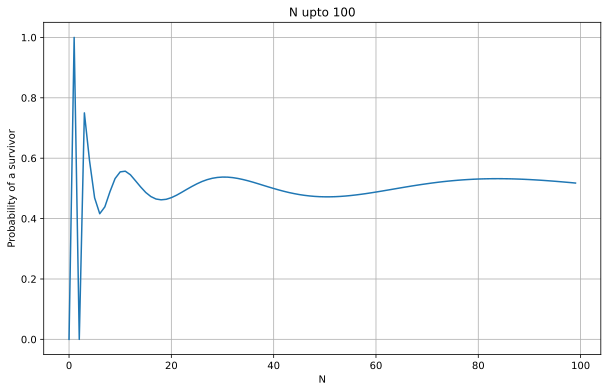
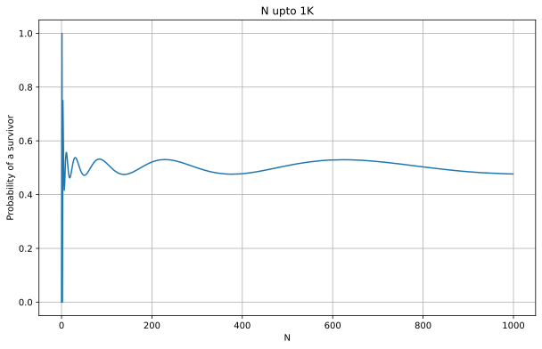
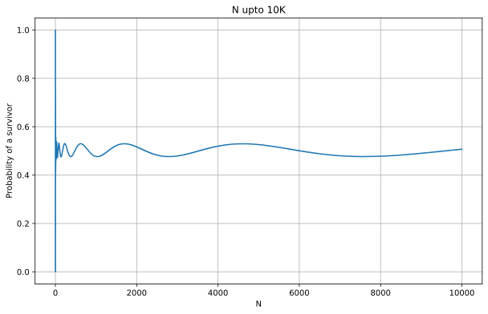

## Question

In a room stand $N$ armed and angry people. At each chime of a clock, everyone simultaneously spins around and shoots a random other person. The persons who get shot, fall dead and the survivors spin and shoot again at the next chime. Eventually, either everyone is dead or there is a single survivor.

As $N$ grows, what is the limiting probability that there will be a survivor?

**Warning**: I could not solve it. The solution only shows what I tried.

## Hint

## Answer

## Solution

I have tried the following scripts

1. [Simulation Script](https://colab.research.google.com/gist/varun-seth/3bb3e08571d2b5ff4e3348ebb9ea5f4b/puzzle_1008_rdd_sim.ipynb#sandboxMode=true)
2. [Brute Forcing Script](https://colab.research.google.com/gist/varun-seth/c57ed32726bf7492daa9dea375398c09/puzzle_1008_rdd_exact.ipynb#sandboxMode=true)
3. [Simulation with Dynamic Programming](https://colab.research.google.com/gist/varun-seth/1b5c9f181e9f61850714af51d1737153/puzzle_1008_rdr_sim_dynamic.ipynb#sandboxMode=true)

Following is the pattern.

It appears to be moving towards 0.5 but I do not have any proof or any intuitive logic as to why.

Also, not sure why these waves appeared, and why the wavelength is expanding.
