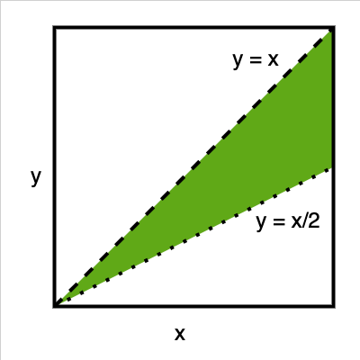

## Question
p and q are two points chosen at random between 0 & 1. What is the probability that the ratio p/q lies between 1 & 2?

## Hint
Graph Shading. (Whenever we see two uniform random variables, we graph them up!)

## Answer
0.25

## Solution
Assume that the points are $x$ & $y$ respectively. We want to know if $x/y$ is between 1 and 2.
If we plot this, the limits are $x/y=1$ and $x/y = 2$. 
Thus, the desired region is the area between lines $y=x$ & $y=x/2$. 

This region is $1/4$ th of the rest.
