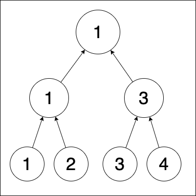

## Question
A chess tournament has $K$ levels and $N = 2^K$ players with skills $P_1 > P_2 > ... >P_{N}$. At each level, random pairs are formed and one person from each pair proceeds to the next level. When two opponents play, the one with the better skills always wins. What is the probability that players $P_1$ and $P_2$ will meet in the final level?

## Hint
if two players meet before the final, they don't meet at the final.

## Answer
$\dfrac{N}{2(N-1)}$

## Solution
Consider $K=1, N=2$, the probability is 1.

Consider $K=2, N=4$; the first round can be in the following ways:

1. $(P_1 \times P_2 ) \times ( P_3 \times P_4 )$
2. $(P_1 \times P_3 ) \times ( P_2 \times P_4 )$
3. $(P_1 \times P_4 ) \times ( P_2 \times P_3 )$

They don't meet in finals in the first case (out of a total of three). Thus, for $K=2, N=4$, the probability that they meet is $2/3$.
<!-- 
I assure you that this probability gets close to 1/2 for large K. 
 -->

Assume that instead of forming random pairs at each level, we have already constructed a "tournament tree", which is a binary tree. At the bottom of this structure, we have the initial $N$ players. Each node represents the match between the two children (players), and the value of each node is the player who won that match. The value of the top-level root node is the overall winner of the tournament.

With this image, we can see the whole tournament is deterministic and only depends on the initial arrangement of players (at the bottom level).
We also notice that the two players who reach the final level are the best players of the left half of the tree and the right of the tree (respectively).

Imagine $N$ players getting partitioned into two groups of $N/2$ players each, with player $P_1$ topping in the first group and player $P_2$ in the second. The best player of each partition reaches the final. The probability that a random partition separates player $P_1$ from $P_2$ is $\dfrac{(N/2)}{(N-1)}$

Here's how: There are $N$ empty slots in a sequence at the bottom layer of the tournament tree.
We can start assigning players from $P_1$.
Suppose $P_1$ is assigned to a slot in the first half. For $P_2$, there are total $N-1$ slots remaining, and $N/2$ are in a new group (that does not contain $P_1$). Hence, there are $(N/2)$ favorable choices and $N-1$ total choices.

Hence the probability is $\dfrac{N}{2(N-1)}$

<!--
Intuitively, this means for creating a partition to separate them, we pick $(N/2)$ people from $N$, wishing to take player 1, but not player 2.  
-->
---

Note: The question says that we are forming random pairs at each level. But that is equivalent to retroactively constructing the bottom-layer of the tournament tree, in any desirable fashion.

For example, consider at the $i$th level, we randomly decide to match $P_j$ with $P_k$, even though they were not siblings in the tree at that level.
That's fine, we can modify the tree such that now $P_j$ and $P_k$ are siblings, while keeping the entire branch below each of those nodes intact.

