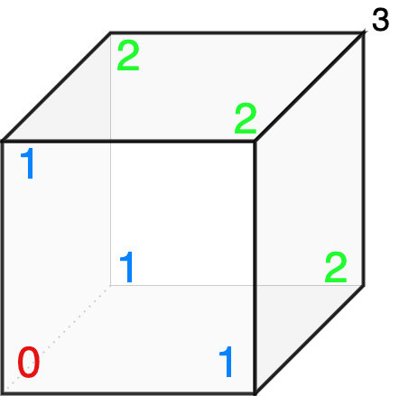

## Question
An ant is standing on one corner of a cube & can only walk on the edges. The ant is drunk and from any corner, it moves randomly by choosing any edge! What is the expected number of edges the ant travels, to reach the opposite corner?

## Hint
Try to find the equivalent vertices for the distance yet to travel. This should give $4$ equivalent merged vertices, with $1$st being the start & the $4$th being the destination.

## Answer
$10$

## Solution

We can define $4$ equivalent states, based on the corner the Ant is at:

0. Starting corner.
1. Corner adjacent to the starting corner.
2. Corner that shares an edge with the opposite corner.
3. The opposite corner.

We can represent the expected number of steps $E_i$ from each state as follows:

1. $E_0 = 1 + \dfrac{1}{3}(E_1 + E_1 + E_1)$

2. $E_1 = 1 + \dfrac{1}{3} (E_0 + E_2 + E_2)$

3. $E_2 = 1 + \dfrac{1}{3}(E_1 + E_1 + E_3)$

4. $E_3 = 0$ (already reached the destination)

Solving this we find $E_0 = 10$

---

Calculations:

$\implies E_0 = 1 + E_1  ~~\&~~ E_2 = 1 + 2/3 \cdot E_1$

Substitute $E_0$ and $E_2$ in the middle equation.

$\implies 3E_1 = 3 + (1 + E_1) + 2 (1 + 2/3 E_1)$

$\implies 3E_1 = 4 + E_1 + 2 + 4/3 E_1$

$\implies 2/3 E_1 = 6 \implies E_1=9 \implies E_0 = 10$
