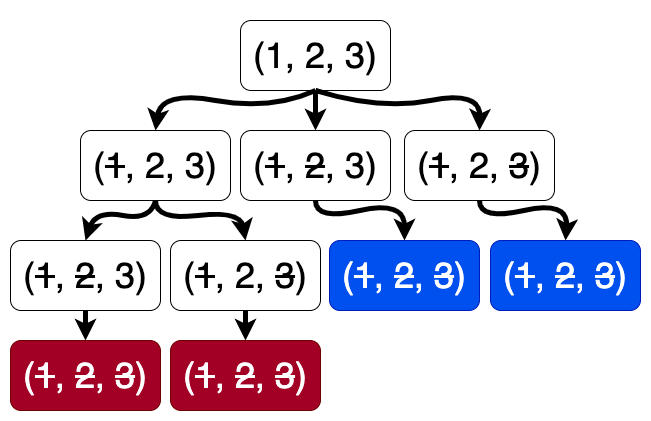
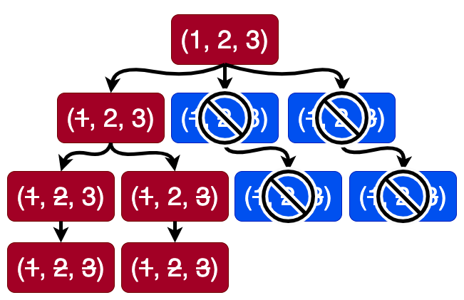

## Question
Two immensely intelligent players, A & B, engage in a game, the rules of which are as follows. For some natural number $N$, the board consists of numbers from $1$ to $N$. Each player takes turns to strike off a (new) number from the board. But, to make sure $N$ doesn't affect who wins, there is an added rule. Once you strike off a number, you also have to strike off all its divisors in that same chance, irrespective of whether any of those divisors were already marked. The player to strike off the last number on the board wins.

Can A construct a winning strategy?

Note: The question asks for the existence of the strategy, not to devise the strategy itself.

## Hint
Can one player copy the strategy of the other?

## Answer
For a given $N$, either $A$ has a winning strategy or $B$. If $B$ has the strategy, then $A$ can strike 1 and copy $B$'s startegy.

## Solution
There is no simple winning strategy, based on the initial number $N$, that A can use to win the game. 

### Determinism

The game can be represented as a tree, where each node represents a possible state of the game, and the children represent valid moves to the next states. 

For instance, for $N=5$, root node is (5, 4, 3, 2, 1). There will be $N$ children nodes.

Let "level" be the number of turns completed so far.

At level $0$, we have the root node. All the states that can be reached by striking one number (and its divisors) are at level  1. And so on.

The height of the tree is at most $N$ (finite).

Many nodes might hold the same state. All the leaf nodes look like empty sets where all numbers are struck off. (~~5, 4, 3, 2, 1~~). If this node is at an odd level then player $A$ has won. Otherwise Player $B$ has won.

Let's color our game tree to represent the winning player in each possible end state. We color a leaf node "red" if the end state it represents is a win for Player $A$, and blue if it's a win for Player $B$. All leaf nodes at odd levels are red. And those are even levels are blue.

Note that both players will try to move rationally toward their favored colored children nodes. Hence we can propagate these colors up.
We consider the following cases:
1. If all children of a node are red, then that node itself becomes red, regardless of the level (odd or even). Same for blue.

2. If a node has both red and blue children, it depends on the player. If it is at an **even** level, then it is Player $A$'s turn. Otherwise Player $B$ is in control. If a node at an even level has atleast one red child-node, then we can color this node as red, and delete the blue children nodes. This is because Player $A$ will rationally move towards the winning state only. Similarly, we can propagate the blue nodes.

<!-- 
Once a node is colored red, it is guaranteed that all the children nodes stay red. If there were any blue children, then those must have been discarded. Similarly, if a node is blue, all its children must be blue.
-->

Thus, we can completely color the entire tree including the root node. It will either be entirely red or entirely blue.
This means that if both players act rationally the winner is predetermined from that state.

### Existence of a Winning Strategy

Now, we examine the color of the root node. If it's red, Player $A$ has a winning strategy right from the start. But can it be blue?

Let's investigate this in details.
From the root node, there can be $N$ children, associated with striking each corresponding number. Consider all children with $i>1$. If any one of these children is red, then root node must be red. But if all are blue, that means that Player $B$ can force a win from any of these states. In other words, regardless of what player $A$ strikes ($2$ to $N$), player $B$ can push the game into a guaranteed  win for player $B$. 

<!-- 
Note that only the player $A$ can start with striking $1$ - a state only accessible from the root node. 
-->

But wait! There's a special move Player $A$ can make: striking out 1. Thus, Player $B$ is put into the same position Player $A$ was in at the start. The special state (~~1~~, 2,..., N) is only accessible from the root node. From here, player B can choose to strike a number from $2$ to $N$. Because of an extra node, all the level-numbers switch from odd to even and vice a versa. Incidentally, this subtree will look exactly like the root tree with reverse colors (and also with one subtree cut-off, corresponding to this node.)

Thus, the root of the subtree representing this new game state is **red** because all the nodes from this point forward are red. This means Player $A$ has a winning strategy from this point.

In conclusion, Player $A$ always has a winning strategy in the Game of Divisors. By either making a move that leads directly to a winning game state, or by striking out 1 and then mirror Player B's ideal moves to force a win.

This is a non-constructive strategy.

---

<!-- 
This game has nothing to do with dynamic programming or number theory. It is an example of how simple rules can sometimes lead to complex problems. 
-->

Using a script to generate the first move for a few values of $N$.

|  $N$  | &nbsp;&nbsp;&nbsp;&nbsp; First move |
| :---: | :---------------------------------: |
|   1   |                  1                  |
|   2   |                  2                  |
|   3   |                  1                  |
|   4   |                  2                  |
|   5   |                  4                  |
|   6   |                  6                  |
|   7   |                  1                  |
|   8   |                  7                  |
|   9   |                  7                  |
|  10   |                  6                  |

<!--
|  11   |                 10                  |
|  12   |                  5                  |
|  13   |                  6                  |
|  14   |                 14                  |
|  15   |                 12                  |
|  16   |                 14                  |
|  17   |                 10                  |
|  18   |                  5                  |
|  19   |                 14                  |
|  20   |                  9                  |
|  21   |                 21                  |
|  22   |                 22                  |
|  23   |                 18                  |
|  24   |                 20                  |
|  25   |                  8                  |
|  26   |                 23                  |
|  27   |                 27                  |
|  28   |                  1                  |
|  29   |                 29                  |
|  30   |                 15                  |
-->

Indeed, the first player always wins, but has to often start by striking  $1$.
