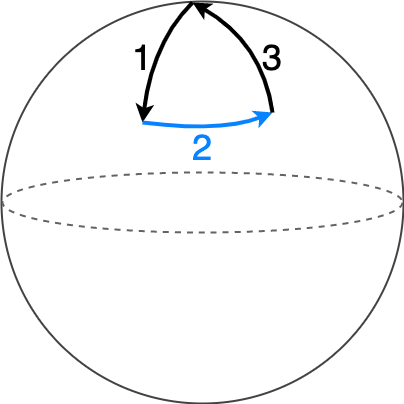

## Question
An explorer walks:
* 1 mile South
* 1 mile East
* 1 mile North. 

And finds themselves back at the starting point. The explorer spots a bear, what is the color of the bear?

## Hint
The surface of the Earth is curved, not flat.

## Answer
White

## Solution
It is not possible to reach the starting point by taking three straight lines, at right angles.
The directions North, East, West or South are defined by movement along latitudes and longitudes. Latitudes are all parallel, but longitudes converge at the poles, due to the spherical shape of the Earth. We can investigate the movement near these poles.

If the explorer is initially standing at the **North Pole**:

1. Every direction from the North Pole is due South. The explorer walks 1 mile South, i.e. away from the North Pole.
2. Walking due East keeps the same distance (one mile) from the North Pole. In other words, the explorer walks along the circumference of a circle with a radius of 1 mile, centered at the North Pole.
3. Walking due north takes them back to the North Pole again.

And a bear living at the North Pole must be a polar bear, which is **white**.

---

### Follow-up Question

The North Pole is not the only point on Earth to satisfy this criterion. How many such points are there? 

### Follow-up Solution

Imagine if $1$ mile was the circumference of the circle along which the explorer walked East, then there can be more points that satisfy the condition.

Can this happen in reality - Yes!

Consider a circle $C_1$ of circumference 1 mile, centered at the south pole, with a radius of $1/(2 \pi)$ miles. If the explorer could start from 1 mile north of this circle, they will reach the starting point after moving 1 mile south, 1 mile east (entire circle) and 1 mile north.
Hence, any point located at about $1 + 1/{(2 \pi)}$ miles away from the south pole satisfies this condition (infinite points).

But wait, there is more! We can also have a circle $C_{1/2}$ of circumference $1/2$ miles, such that the explorer makes two turns around this circle while moving East. In general, the explorer can start from any point with the radius $(1 + \dfrac{1}{2\pi n})$ for any natural number $n$.

### The curious case near the South Pole
In the above formula, as $n$ increases, the latitude circles keep shrinking. Eventually down to the South Pole itself. Incidentally, moving East while standing on the South Pole is either impossible or equivalent to spinning. But if standing still is a valid movement towards the East, then the explorer can start anywhere on the latitude (circle) with a radius of 1 mile, centered at the South Pole, and reach the starting point after traveling for three miles, although it is debatable that the explorer only traveled for two miles.
