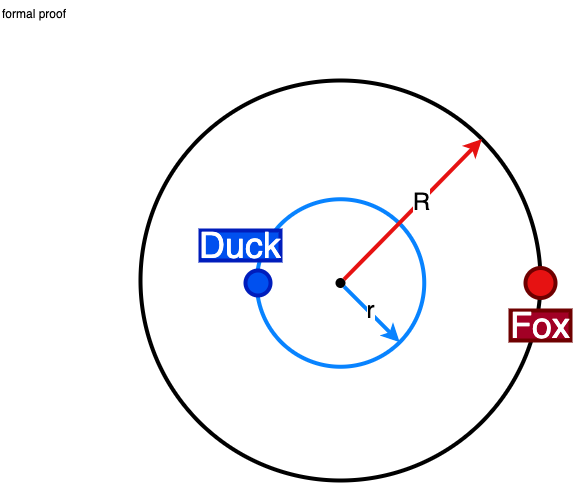

## Question
A duck is sitting at the center of a circular lake. A fox is waiting at the shore, not able to swim, wishing to eat the duck. The Fox can move around the whole lake at a speed four times the speed at which the duck can swim. The duck can fly, but only once it reaches the shore of the lake, it can't fly from the water directly. Can the duck always reach the shore without being eaten by the fox?

Note: This is an old duck, and cannot take a flight while swimming. The duck cannot submerge in the water.

## Hint
The fox is greedily chasing the duck. If the duck's angular speed is (somehow) more than the fox, there can be a phase lag.

## Answer
At a radius of slightly less than $R/4$, the duck can swim in circles, forcing the fox to run around. Once the duck is at a phase of $\pi$ from the fox it starts swimming towards the shore and flies away.

## Solution

This is a classic problem involving geometry and relative speed, often referred to as the "Duck and Fox Problem". Here's the approach:

1. **Swim in Circles:** The duck begins by swimming in a circle with a radius of $r < R/4$ where $R$ is the radius of the lake. The center of this circle is the same as that of the lake. The fox is four times as fast as the duck. By swimming in a small circle, the duck can start creating an angular separation between itself and the fox.

2. **Force the Fox to Run:** Since the fox is trying to chase the duck, it will continue to run around, trying to move to the point nearest to the duck but on the shore. As the duck goes around slightly faster, the fox lags behind. Eventually, the duck will be at a point where the fox is directly across the lake from it.

3. **Wait for the Right Moment:** The duck continues swimming in its smaller circle until the fox is straight across the lake from it. At this point, the duck and fox are separated by half the circumference of the lake, a distance that the fox has to cover to reach the duck if it heads straight for the shore.

4. **Head for the Shore:** While standing directly opposite, the duck can now swim straight to the shore. Duck has to travel around $R \cdot 3/4$ distance, while the fox has to travel $\pi R$. Given the ratio of their speeds, it will take $3 R$ and $3.14 \cdot R$ units of time respectively. Hence the duck will have a few extra moments to start the flight.

5. **Escape:** Reaching moments before the fox, the duck can now fly away to safety.

---

### Limits of $r$

Let us also formalize the limits of the choice of $r$. 

It is slightly less than $R/4$, to create a phase lag

$r < R/4$ (to create a phase lag)

Also, in the end, the remaining time to reach the shore should be less for the duck, than the fox.

$\dfrac{(R-r)}{1v} < \dfrac{\pi R}{4v}$ (where $v$ is the speed.)

Solving these two equations gives:

${R} \cdot (1 - \dfrac{\pi}{4}) < r < \dfrac{R}{4}$

Hence, the inner circle can have a radius between $21.5\%$ to $25\%$ of $R$
